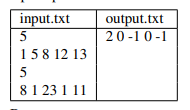

## Бинарный поиск
В этой задаче вы реализуете алгоритм бинарного поиска, который позволяет
очень эффективно искать (даже в огромных) списках при условии, что список
отсортирован. Цель - реализация алгоритма двоичного (бинарного) поиска.
• Формат входного файла (input.txt). В первой строке входного файла содержится число n (1 ≤ n ≤ 105
) — число элементов в массиве, и последовательность a0 < a1 < ... < an−1 из n различных положительных целых
чисел в порядке возрастания, 1 ≤ ai ≤ 109 для всех 0 ≤ i < n. Следующая
строка содержит число k, 1 ≤ k ≤ 105 и k положительных целых чисел
b0, ...bk−1, 1 ≤ bj ≤ 109 для всех 0 ≤ j < k.
• Формат выходного файла (output.txt). Для всех i от 0 до k − 1 вывести
индекс 0 ≤ j ≤ n − 1, такой что ai = bj или -1, если такого числа в массиве
нет.
• Ограничение по времени. 2сек.
• Ограничение по памяти. 256 мб.  

В этом примере есть возрастающая последовательность из a0 = 1, a1 =
5, a2 = 8, a3 = 12 и a4 = 13 длиной в n = 5 и пять чисел для поиска: 8 1 23
1 11. Видно, что a2 = 8 и a0 = 1, но чисел 23 и 11 нет в посл